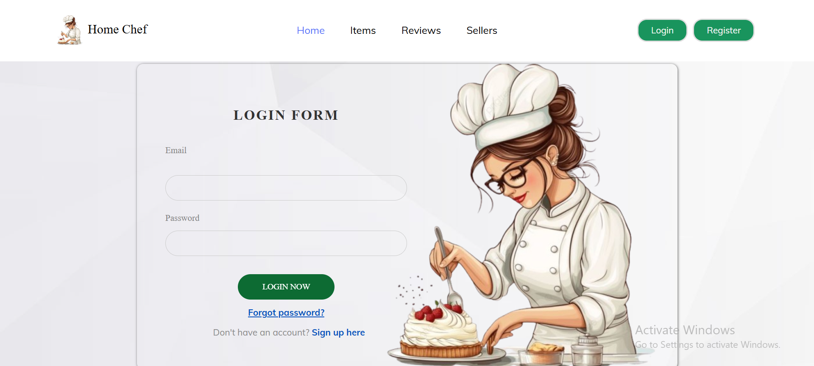

# 🍳 HOME CHEF BUY & SELL PLATFORM

## 📝 PROJECT DESCRIPTION

This is my **Semester 2 Final Project** – a full-stack web-based food ordering and management system.  
The platform enables **Customers**, **Chefs/Publishers**, and **Admins** to interact with the system in different ways.

- **Customers** can browse meals, add them to the cart, place orders, view order history, and receive real-time order confirmation emails.
- **Chefs / Publishers** can create and manage their dishes, update prices, and view order analytics.
- **Admins** can manage users, menu items, chefs, and all orders while monitoring system activities.

The platform integrates third-party APIs such as **FreeImage** for image hosting and **PayHere** for handling payments.

---

## ⚙️ SETUP INSTRUCTIONS

Follow these steps to run the project locally.

## Screenshots
 
Home Page

Login

Buyer Profile

Buyer Dashboard

Shopping Cart

Add Items

Checkouts

### 🔹 Full Project
Clone the repository:

git clone https://github.com/nishadii99/Home_Chef.git
🔹 Configure the Database

Edit application.properties:

spring.datasource.url=jdbc:mysql://localhost:3306/home_chef
spring.datasource.username=your_username
spring.datasource.password=your_password
spring.jpa.hibernate.ddl-auto=update

🔹 Run Backend Application
mvn spring-boot:run

🔹 Run Frontend

Open the index-1.html file (Use Live Server).

🔹 Additional Configurations

FreeImage API Key → Add your API key in the image upload function.

PayHere → Add your merchant ID and secret in the payment integration code.

🎥 DEMO VIDEO

👉 Watch the Demo: https://youtu.be/-ccpeBbvGBY

🛠️ TECH STACK

Backend: Java 21, Spring Boot, Hibernate, JWT, Maven

Database: MySQL

Frontend: HTML, CSS, JavaScript, Bootstrap

Third-party APIs: FreeImage

Payment Gateway: PayHere

📬 CONTACT

If you would like to get in touch with me:

📧 Email: kavindyanishadi99@gmail.com

🙏 THANK YOU

Thank you for taking the time to explore my project! Your feedback and suggestions are always welcome. 🚀
Thank you for taking the time to explore my project! Your feedback and suggestions are always welcome. 🚀
